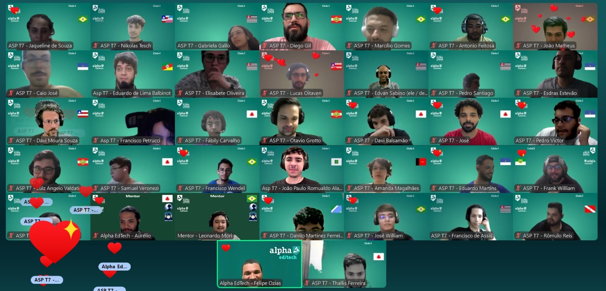

# 🚀 Minha Jornada de Conhecimento em TI (Turma 7) até o momento (30/11/2025)

Meu nome é **José William**, e sou um aspirante da **Turma 7** da edtech. Minha jornada de aprendizado até agora foi marcada pela imersão em conhecimentos fundamentais e avançados na área de **Tecnologia da Informação**, desde a base de redes e internet até o essencial controle de versão com Git e segurança digital. Tive a oportunidade de aprender com excelentes professores como **Kenji Taniguchi**, **Paulo Marcotti** e **Felipe Ozias**, conheci diversas pessoas e, o mais importante, construí uma base sólida e detalhada sobre o funcionamento da infraestrutura digital e das boas práticas de desenvolvimento.

Abaixo, apresento um resumo dos principais conteúdos abordados em nossas aulas HARD.

---

*Figura 1: Visão geral da AULA HARD #12 sobre Branches e Merge no Git.*

## 💻 Módulo I: Redes, Internet e Protocolos (Prof. Kenji Taniguchi)

Este módulo estabeleceu a fundação sobre como a internet e as redes de computadores funcionam, desde os conceitos mais básicos de comunicação até a arquitetura global.

### 🌐 Fundamentos de Redes e Protocolos

* **Conceitos Iniciais:**
    * Topologia utilizada pelos backbones.
    * Diferença entre **Internet**, **Intranet** e **Extranet**.
    * Significado e funcionamento de **AJAX**.
* **Protocolos de Comunicação (Aula 03):**
    * Detalhes do **NAT** (Network Address Translation) e seus problemas.
    * Diferença entre cabeçalhos **TCP** e **UDP**, e qual é mais usado na web.
    * A importância do **TLS** (Transport Layer Security).
    * Conceito de **Contratos Inteligentes**.
* **Endereçamento IP, Sub-redes e Portas (Aulas 03 & 04):**
    * Detalhes sobre **IPV4** (classes, limites) e **IPV6** (o que resolveu, tamanho).
    * Conceitos de **Unicast**, **Multicast** e **Broadcast**.
    * Funcionamento da **Máscara de Rede**.
    * **Bloqueio de Portas** por provedores e como contornar.
    * **QOS** (Quality of Service) e **VPNs** (Virtual Private Networks).
    * **Firewall**: Tipos e funcionamento.

### 🏛️ Arquitetura e Serviços da Internet

* **Serviços e Aplicações (Aulas 04 & 05 - Profs. Kenji e Paulo Marcotti):**
    * **API RESTFul**: Definição e segurança.
    * Arquitetura de **3 Camadas** (quais são e como funcionam).
    * Formatos de Dados: Diferença e usos de **JSON** e **XML**, além de **Protobuf** e **YAML**.
    * **Microsserviços** e **Web 2.0 / SPA** (Single Page Application).
    * Autenticação com **OAuth**.
    * Proteção de dados na transmissão cliente-servidor.
* **DNS (Domain Name System) (Aula 06):**
    * Funcionamento do DNS, incluindo **NS Lookup**.
    * **Registro PTR** (Pointer) e **DNS Dinâmicos**.
    * **Envenenamento de Cache** e como evitar.
    * Disponibilidade de servidores e **Balanceamento de Carga**.
    * Registro de Domínios: regras e entidades de registro.
* **Arquitetura da Internet (Aula 07):**
    * **Ataques DDoS** (Como ocorre, exemplos - Microsoft Azure, Cloudflare) e **Mitigação** (Blackholing, Rate Limiting).
    * Roteamento **Multicast** e **Unicast**.

### 💻 Redes de Computadores e Ameaças (Aulas 08 & 09)

* **Estrutura de Redes (Aula 08):**
    * Tipos de Redes: **LANs**, **WANs**, **MANs** e **PANs** (Funcionamento, Uso e Protocolos).
    * Arquiteturas **Ethernet** e **Token Ring** (comparação, lista circular).
    * Conceitos de **Latência** e **Insider Threat** (O que são e prevenção).
* **Segurança de Redes (Aula 09):**
    * Principais **Ameaças** de segurança, incluindo o perigo da **Engenharia Social** e **IA**.
    * Conceitos de **Disponibilidade**, **Integridade** e **Acessibilidade**.
    * **Malwares**.
    * **VPNs** (Acesso remoto, Site-a-site) e alternativa para rede.
    * Diferença crucial entre **Container** e **Virtual Machine**.
    * Gerenciamento de **Patches e Atualizações**.

### 🔒 Segurança na Web (Aula 10 - Prof. Paulo Marcotti)

* **HTTPS e Criptografia:**
    * Vulnerabilidades do **HTTP**.
    * **HTTPS** para garantir integridade e confidencialidade.
    * Fundamentos da **Criptografia**, **Hash** e **MD5**.
    * **Criptografia Simétrica** e **Assimétrica**.
    * Funcionamento da **Criptografia de Ponta a Ponta** e suas limitações.
* **Certificados SSL/TLS:**
    * **Handshake SSL/TLS**.
    * Estrutura de um certificado e o papel das **Autoridades Certificadoras (CAs)**.
    * Processo de emissão, instalação, renovação e consequências da expiração.

---

## 📦 Módulo II: Controle de Versão com Git (Prof. Felipe Ozias)

Este módulo é essencial para a colaboração e a manutenção de código em projetos de software.

### 🛠️ Fundamentos do Git e Ferramentas (Aula 11)

* **Configurações e Comandos:**
    * Local de configurações do Git.
    * Diferença prática entre **`Git restore`** e **`Git reset`**.
    * Cuidados no uso de tags, como **`--hard`**.
    * Passo a passo de criação/edição de arquivos no Git.
    * **Boas Práticas para Commits**.
* **Estrutura do Repositório:**
    * Conexão entre **Índice (Staging Area)** e **Working Tree**.
    * Uso do arquivo **`.gitignore`**.
* **Ferramentas:**
    * Uso do **VSCode** e da extensão **GitLens**.

### 🌳 Branches e Fluxo de Trabalho (Aula 12)

* **Branches:**
    * **O que é uma branch** e sua importância para o desenvolvimento paralelo.
    * **Convenções** e **Uso Seguro** de branches.
* **Estrutura Interna do Git:**
    * Como funciona o **Head**.
    * Visualização e manipulação do **Histórico de Alterações**.
    * Uso de **Flags**.
* **Comandos Essenciais:**
    * **`git stash`**: Para salvar alterações temporariamente.
* **Merge:**
    * Realização de **Merge**.
    * Resolução de **Conflitos** de merge.

---

## 🎯 Conclusão e Próximos Passos

Minha jornada tem sido intensa e bem produtiva, cobrindo os pilares da infraestrutura, segurança e práticas de desenvolvimento. O conhecimento adquirido sobre **Redes, Segurança (Web e Redes)** e **Controle de Versão (Git)** está me ajudando no meu dia a dia, principalmente no meu estágio como desenvolvedor em um órgão público do estado do Ceará.

O próximo passo no nosso curso será aprofundar o **Controle de Versão** com foco no **Repositório Remoto**, conectando o conhecimento local do Git à colaboração em ambientes como GitHub ou GitLab.